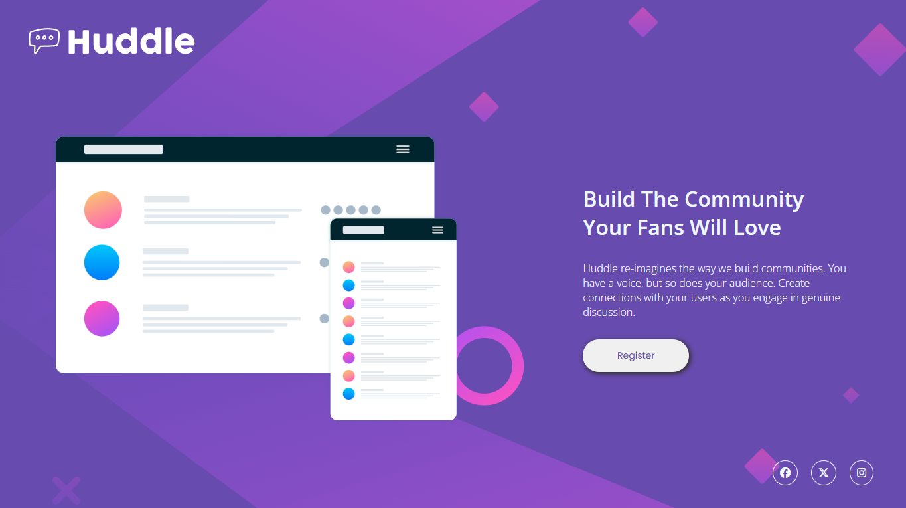
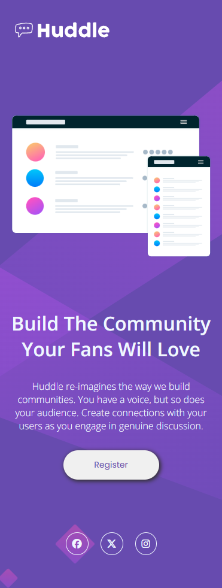

# Desafio Huddle landing page!
Com esse desafio consegui testar e melhorar minhas habilidades como programador, principalmente no uso do layout flexbox e não pude deixar de praticar a semântica do meu código.

## Visão Geral
Nesse desafio eu procurei melhorar:
- O uso do layout flexbox
- A semântica do código
- A responsividade, principalmente em dispositivos médios.

### Abaixo estão os modelos seguidos e os resultados
- Desktop
   
    - Modelo: 

        

    - Resultado:

        

- Mobile

    - Modelo:

        
    - Resultado:

        